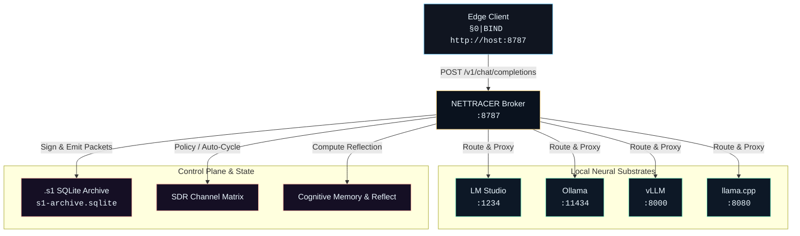
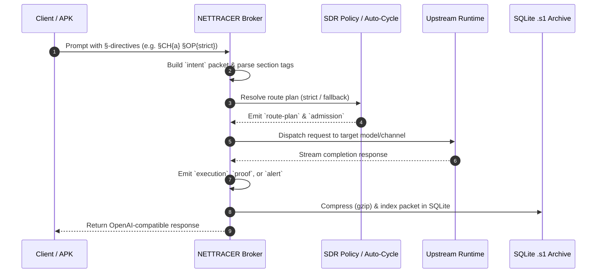
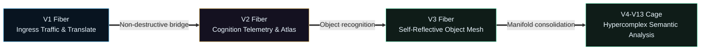

<div align="center">

```text
  ┌─────────────────────────────────────────────────────────┐
  │  ネ ッ ト ワ ー ク ・ ト レ ー サ ー                    │
  │  N E T T R A C E R  //  v 0 . 1 . 0                    │
  │  Topos Orchestration Broker & Section Language Substrate │
  └─────────────────────────────────────────────────────────┘
```

[](https://nodejs.org/)
[](LICENSE)
[](.github/workflows/ci.yml)
[](#-section-language--s1-protocol)

*A local-first, zero-trust Topos orchestration broker interposing across neural runtimes, section-language control planes, and hypercomplex manifold projections.*

---

</div>

## 概要 // OVERVIEW

**NETTRACER** is a local-first Topos orchestration broker for connecting edge clients, local model runtimes, and observable control-plane state.

An edge client binds once to the broker. In turn, `netracer`:
- Interposes across local LLM runtimes (LM Studio, Ollama, vLLM, llama.cpp),
- Emits signed `.s1` control-plane packets across a 7-stage lifecycle,
- Enforces software-defined route policies (SDR),
- Exposes an operator cockpit, HoloView Catalina HUD, and hypercomplex version manifold projections (V1–V13).

The visual language is intentionally playful; the runtime contract is intentionally boring: HTTP, WebSocket, SQLite, Prometheus text metrics, and environment-based configuration.

---

## システム構造 // ARCHITECTURE

### 1. Topos Broker Flow



### 2. `.s1` Packet Lifecycle & Section-Language Pipeline



### 3. Version Manifold (V1 – V13)



---

## 機能 // CAPABILITIES

- **OpenAI-Compatible Compatibility Surface**:
  - `GET /v1/models`
  - `POST /v1/chat/completions`
  - `POST /v1/embeddings`
- **`.s1` Packet Lifecycle Classes**:
  - `intent` • `route-plan` • `admission` • `execution` • `proof` • `audit` • `alert`
- **Multi-Runtime Orchestration**: Policy-aware upstream selection across local engines with real-time health checks.
- **Software-Defined Routing (SDR)**: Alias channels, operation profiles, and in-prompt directives (`§CH{a}`, `§OP{strict}`, `§ROUTE{...}`).
- **Continuous Auto-Cycle Loop**: Autonomous failover and failback based on upstream probes.
- **Native SQLite Archive**: `.s1` packet compression (`gzip`) with quantitative & qualitative insight projections.
- **HoloView Catalina HUD**: Interactive WebGL/Canvas renderer with 10 view profiles (gold-disk, fiber-orbit, manifold-grid, etc.).
- **SLANG Topology & Cognitive Reflection**: Deterministic runtime self-assessment scoring 30+ cognitive and operational qualities.

---

## 監視・操作エンドポイント // ENDPOINTS & SURFACES

### Operator Surfaces

| Surface | Path / Endpoint | Description |
|---|---|---|
| **Dashboard Cockpit** | `GET /` | Main operator dashboard |
| **V2 Cognition Trace** | `GET /cognition` | Hyperbolic stream & cognitive reflection UI |
| **.s1 Observatory** | `GET /s1` | Packet volume, motifs, and sheaf analysis |
| **V3 Object Mesh** | `GET /v3/object-mesh` | Virtual 360x360 hypercomplex orthogonal manifold |
| **V4 Version Cage** | `GET /v4/version-cage` | Cross-version bridge consolidation UI |
| **V5 AAA Cosmos** | `GET /v5/aaa-cosmos` | WebGL 3D depth scene with navigable worlds |
| **Health Check** | `GET /healthz` or `GET /health` | System health probe |
| **SLANG Topology** | `GET /api/slang/topology` | Node set with SLANG negotiation coverage |
| **Cognitive Reflection** | `GET /api/slang/cognitive` | Deterministic self-assessment score |
| **Reservoir Scheme** | `GET /api/slang/reservoir` | Reservoir-computing state & spectral radius |

### Secure Control Actions

| Action | Endpoint | Description |
|---|---|---|
| **Authentication** | `POST /api/auth/login` | Session login with operator passkey |
| **Replay Packet** | `POST /api/packets/replay` | Re-emit historic packet through control plane |
| **Route Pinning** | `POST /api/routes/pin` | Force route binding for target client |
| **Runtime Toggle** | `POST /api/runtimes/:id/enable` | Enable or disable specific upstream runtimes |
| **SDR Channel Upsert** | `POST /api/channels/upsert` | Update or add software-defined route channels |
| **Auto-Cycle Trigger** | `POST /api/autocycle/run` | Execute control-loop failover cycle |
| **Archive Compact** | `POST /api/archive/compact` | Flush and compact memory trace to SQLite |
| **Pack Upgrade** | `POST /api/slang/packs/upgrade` | Upgrade active SLANG pack across topology |

---

## 実行方法 // RUN & DEPLOYMENT

### Quick Start

```powershell
# Install dependencies
npm install

# Run the test suite
npm test

# Start the broker (default bind: 0.0.0.0:8787)
npm start
```

### Zero-upstream demo

Run the broker with synthetic `.s1` traffic so the dashboard and metrics are useful before any model runtime is configured:

```powershell
npm start -- --demo
# dashboard: http://127.0.0.1:8787/
# metrics:   http://127.0.0.1:8787/metrics
# health:    http://127.0.0.1:8787/healthz
```

Use `HOST=127.0.0.1` when the broker should remain local-only. Use `PORT=<port>` when the default port is already occupied.

### Environment Variables

| Variable | Default | Description |
|---|---|---|
| `HOST` | `0.0.0.0` | Bind host IP (`127.0.0.1` for local-only) |
| `PORT` | `8787` | HTTP/WebSocket server port |
| `DATA_DIR` | `data` | Root directory for trace, state, and archive storage |
| `OPERATOR_PASSKEY` | *(Auto-generated)* | Operator passkey (saved to `data/state/operator-passkey.txt`) |
| `NNN_BRIDGE_ENABLED` | `1` | Enable/disable NNN hyperbolic sidecar bridge |
| `TELOS_BASE_URL` | *(unset)* | Optional base URL for an external topology validator |

### Windows Service Watchdog

An enterprise supervisor service is included under `windows-service/Netracer.ServiceHost`.

```powershell
# Install service (Elevated PowerShell)
.\scripts\install-service.ps1 -TakeoverExisting

# Uninstall service (Elevated PowerShell)
.\scripts\uninstall-service.ps1
```

---

## 開発・貢献 // DEVELOPMENT & LICENSING

- **Testing**: Run unit tests via `npm test` (`node --test`).
- **Contributing**: Please review [CONTRIBUTING.md](CONTRIBUTING.md) before submitting pull requests.
- **Security**: Security findings should be submitted according to [SECURITY.md](SECURITY.md).
- **License**: [BSD 3-Clause License](LICENSE).

---

<div align="center">

```text
  ┌─────────────────────────────────────────────────────────┐
  │  BSD 3-Clause  ·  2026  ·  NETTRACER contributors       │
  │  "confidence can move faster than evidence."            │
  └─────────────────────────────────────────────────────────┘
```

</div>
